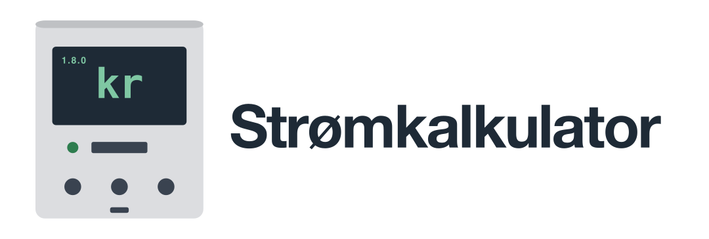
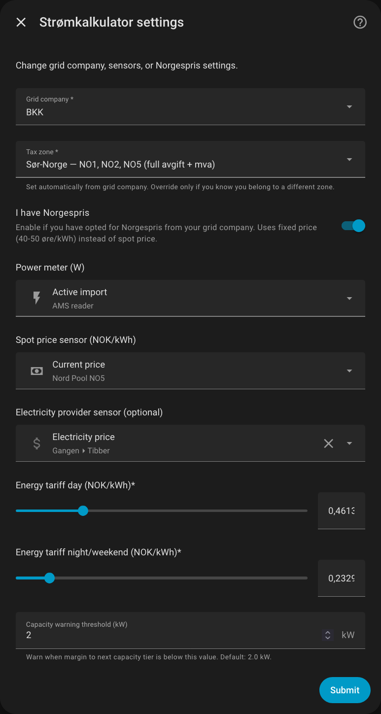
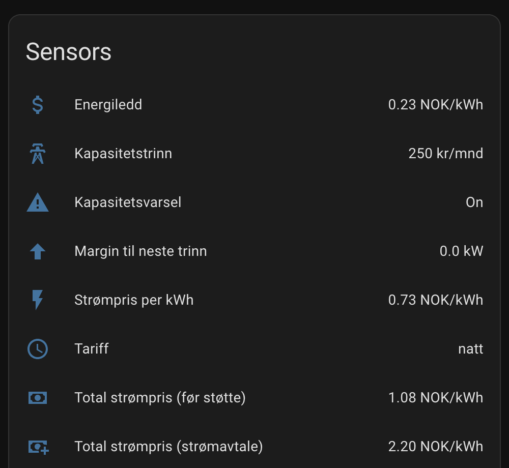
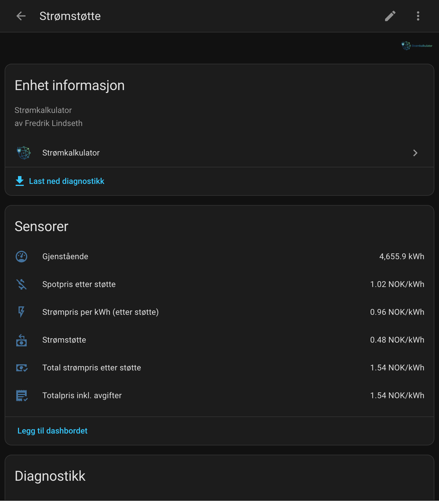
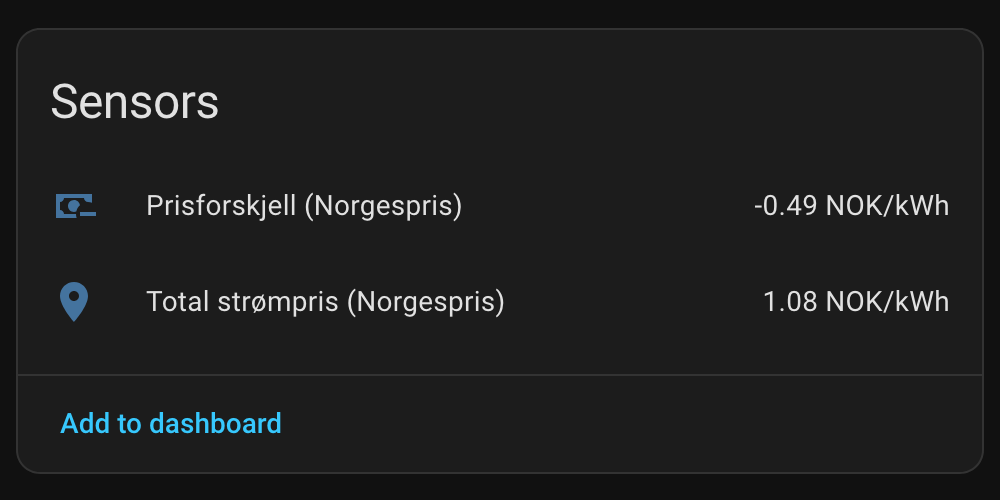
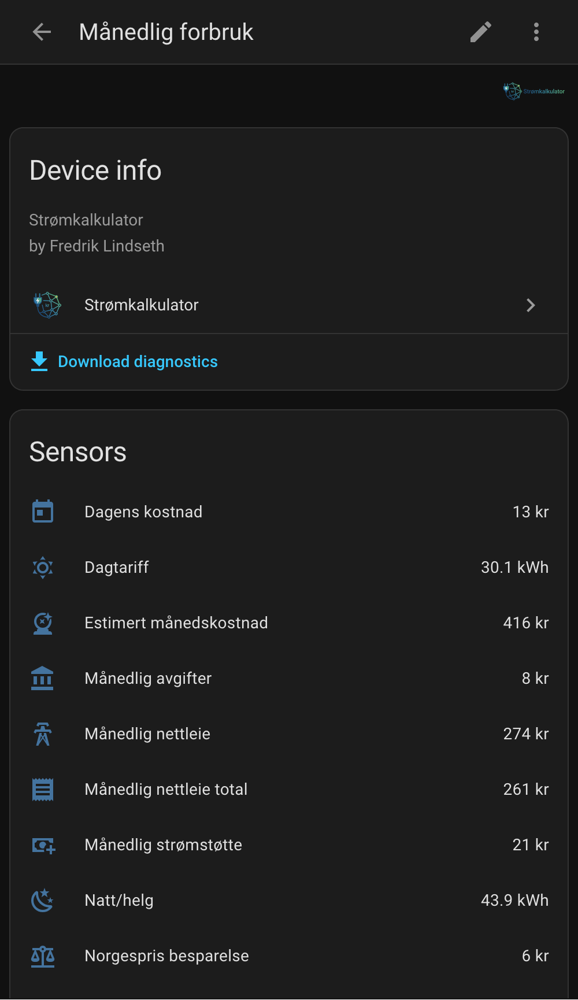
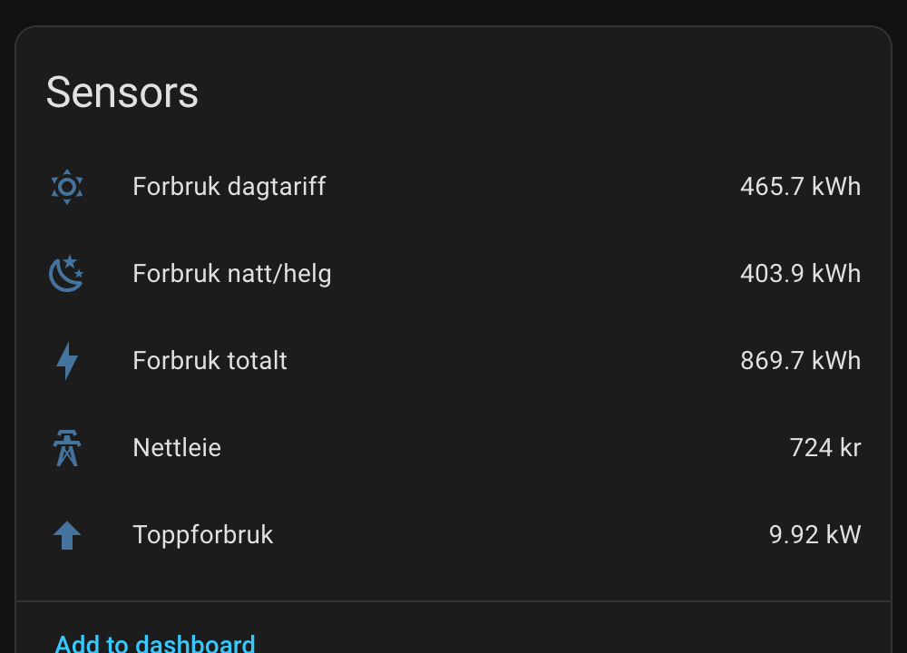
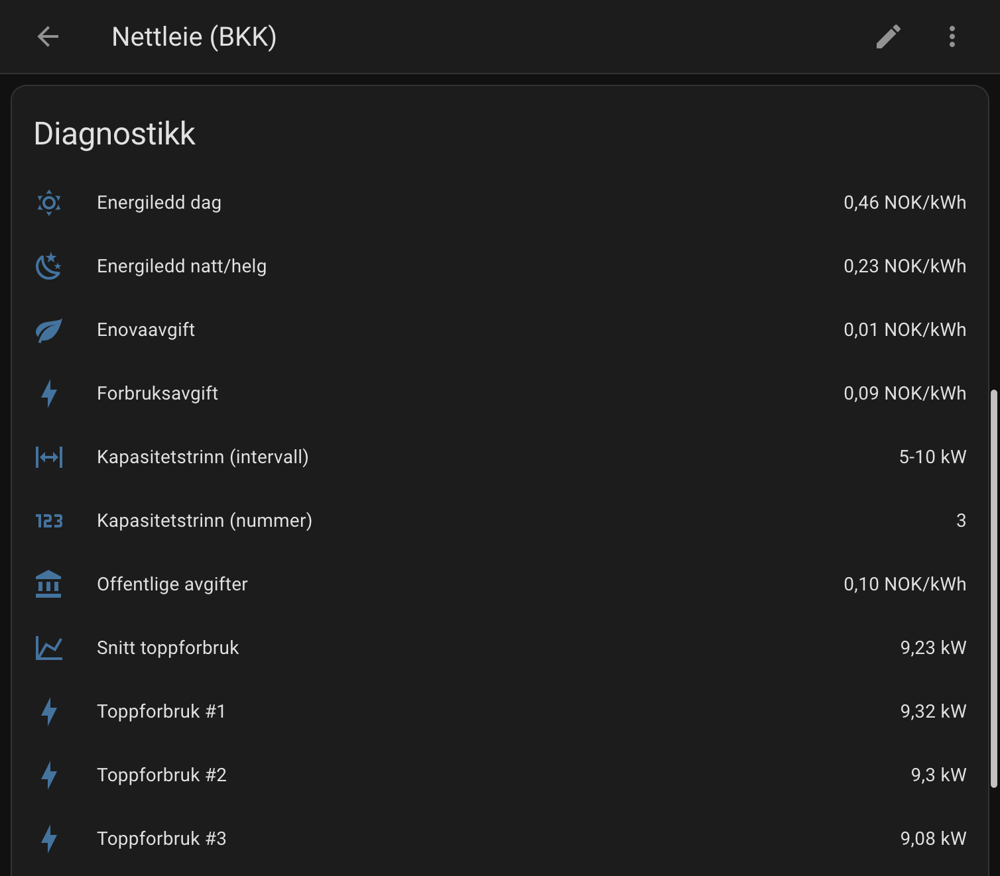

  

  
  
  
  
  
  
  

**[Norsk versjon / Norwegian version](README.md)**

Home Assistant integration that calculates the **actual electricity price** in Norway - including grid tariffs, taxes, and government subsidies.

## What You Get

This integration provides sensors showing your **actual electricity cost** - not just the spot price. It calculates:

- **Grid tariffs** - Energy component (day/night rates) and capacity component from your grid company
- **Electricity subsidy** - Automatic calculation (90% above 96.25 øre/kWh)
- **Total price** - Everything included, ready for Energy Dashboard
- **Monthly consumption** - Tracks usage and costs per month
- **Invoice verification** - Compare with your invoice when it arrives

## Installation

### Via HACS (recommended)

1. **HACS** > **Integrations** > Menu (three dots) > **Custom repositories**
2. Add `https://github.com/fredrik-lindseth/Stromkalkulator` as "Integration"
3. Download "Strømkalkulator"
4. Restart Home Assistant

### Manual

Copy `custom_components/stromkalkulator` to `/config/custom_components/`

## Setup

**Settings > Devices & Services > Add Integration > Strømkalkulator**

### Step 1: Select grid company

Select your grid company from the dropdown. Tax zone (VAT and consumption tax) is set automatically based on your grid company.

### Property type

| Property type | Electricity subsidy | Norgespris cap | Source |
|---------------|---------------------|----------------|--------|
| Residence (default) | 5000 kWh/month | 5000 kWh/month | [Regulation § 5](https://lovdata.no/dokument/SF/forskrift/2025-09-08-1791) |
| Holiday home | None | 1000 kWh/month | [Regulation § 3](https://lovdata.no/dokument/SF/forskrift/2025-09-08-1791) |
| Holiday home (permanent residence) | 5000 kWh/month | 5000 kWh/month | [Regulation § 11](https://lovdata.no/dokument/SF/forskrift/2025-09-08-1791) |

Above the Norgespris kWh cap, you pay spot price for the rest of the month. Holiday homes are not entitled to electricity subsidy unless you live there permanently (§ 11).

### Step 2: Select sensors

You need two sensors:
- **Power meter (W)** - Sensor showing current power consumption in watts. Typically from an AMS reader via the HAN port (e.g. Tibber Pulse).
- **Spot price sensor (NOK/kWh)** - Sensor with current spot price. Usually "Current price" from the [Nord Pool integration](https://www.home-assistant.io/integrations/nordpool/).
- **Electricity provider sensor** (optional) - Total price from your provider (e.g. Tibber). Used to show what you actually pay.

All Norwegian grid companies are supported!

### Tax zones

The tax zone determines VAT and consumption tax, and is set automatically from your grid company. You can override in settings if needed.

| Tax zone          | Price areas    | Consumption tax | VAT  |
|-------------------|----------------|-----------------|------|
| Southern Norway   | NO1, NO2, NO5 | 7.13 øre/kWh   | 25%  |
| Northern Norway   | NO3, NO4      | 7.13 øre/kWh   | 0%   |
| Tiltakssonen      | Finnmark/Nord-Troms | 0 øre      | 0%   |

## Devices and Sensors

The integration creates five devices with sensors:

### Grid Tariff (Nettleie)

Real-time prices and calculations for grid tariffs, electricity subsidy, and total price.

### Electricity Subsidy (Strømstøtte)

Shows how much you receive in electricity subsidy (90% above 96.25 øre/kWh).

### Norway Price (Norgespris)

Compares your spot price contract with Norgespris - so you can see what's more economical.

### Monthly Consumption (Månedlig forbruk)

Tracks consumption and costs for the current month, split by day and night/weekend tariff.

### Previous Month (Forrige måned)

Stores previous month's data for easy invoice verification.

## Using with Energy Dashboard

Energy Dashboard needs two things: a **consumption meter** (kWh) and a **price sensor** (NOK/kWh). Strømkalkulator provides the price sensor — the consumption meter comes from your power meter integration.

### What comes from where?

| What                 | Sensor                         | Source                   |
|----------------------|--------------------------------|--------------------------|
| Consumption (kWh)    | Your consumption meter         | AMS meter via HAN port (e.g. Tibber Pulse)  |
| Price (NOK/kWh)      | **Total price incl. taxes**    | Strømkalkulator          |

### Step-by-step setup

1. Go to **Settings > Dashboards > Energy**
2. Under **Electricity grid**, click **Add consumption**
3. **Consumed energy** — select your kWh consumption sensor (e.g. `sensor.power_consumption` from your AMS meter)
4. Enable **Use an entity with current price**
5. Select **Total price incl. taxes** (`sensor.totalpris_inkl_avgifter_*`)
6. Click **Save**

The dashboard now shows what your electricity actually costs — including grid tariffs, taxes, and subsidies.

> **Don't have a kWh sensor?** You need something that reads your AMS meter via the HAN port, e.g. a [Tibber Pulse](https://www.home-assistant.io/integrations/tibber/) or another AMS reader.

**Tip:** Want to see price components (spot price, grid tariff, taxes) separately? Use a custom dashboard card like ApexCharts with the sensors from this integration.

## Electricity Plans

### Spot Price (most common)

If you have a regular spot price contract:
- The electricity subsidy (90% above 96.25 øre) is automatically deducted
- The "Electricity Subsidy" sensor shows how much you receive

### Norway Price (Norgespris)

Have you chosen [Norgespris](https://www.regjeringen.no/no/tema/energi/strom/regjeringens-stromtiltak/) from your grid company?

1. Check "I have Norgespris" during setup
2. Fixed price is used: 50 øre (Southern Norway) or 40 øre (Northern Norway)
3. No subsidy - Norgespris replaces spot price and subsidy

### Comparing Plans

Not sure what's best for you? The "Price Difference Norgespris" sensor shows:
- **Positive value** = You save with Norgespris
- **Negative value** = Spot price is cheaper right now

## Verifying Against Invoice

When your grid tariff invoice arrives, you can easily verify the numbers:

1. Go to **Settings > Devices & Services > Strømkalkulator**
2. Click on the "Previous Month" device
3. Compare the values with your invoice

**Tip:** Click on a sensor to see details like top-3 power days and costs split by day/night.

## Supported Grid Companies

**All Norwegian grid companies are supported!** 🎉

Prices are updated annually at the start of each year. Found an error or outdated prices? [Create a PR](docs/CONTRIBUTING.md) or open an issue!

## Limitations

This integration is designed for **residential homes with individual electricity subscriptions**.

**Not supported (yet):**
- Commercial use (different subsidy rates)
- Housing cooperatives with shared metering

**Future ideas:**
- Alert when capacity tier increases
- Support for commercial use
- Invoice import (PDF/CSV)

## Frequently asked questions

**Why does the sensor show "natt" (night) in the middle of the day?**

The "natt" (night) tariff isn't just for nighttime. It's actually "natt/helg" (night/weekend) and applies during:
- Nights (22:00-06:00) every day
- All weekends (Saturday and Sunday, all day)
- Public holidays (all day)

So on a Saturday at 14:00, "natt" tariff is correct — you're paying the lower rate.

**Why is "Totalpris inkl. avgifter" higher than the spot price?**

The spot price is just the electricity. Total price also includes grid tariff (energy + capacity component), consumption tax, Enova levy, and VAT. For most people, grid tariff and taxes make up 30-50% of the total price.

**Electricity subsidy shows 0 — is that wrong?**

No. The subsidy is only paid when the spot price exceeds 96.25 øre/kWh (2026). When the price is lower, the subsidy is 0.

**The numbers don't quite match my invoice?**

1-5% deviation is normal. The integration calculates consumption from the power sensor (Riemann sum), while the invoice uses the electricity meter's kWh counter. See [beregninger.md](docs/beregninger.md#nøyaktighet) for details.

## Documentation

| Document                                | Content                    |
|-----------------------------------------|----------------------------|
| [SENSORS.en.md](docs/SENSORS.en.md)     | All sensors and attributes |
| [beregninger.md](docs/beregninger.md)   | Formulas and tax zones     |
| [CONTRIBUTING.md](docs/CONTRIBUTING.md) | Update prices / report errors |
| [TESTING.md](docs/TESTING.md)           | Validating calculations    |

## License

MIT
